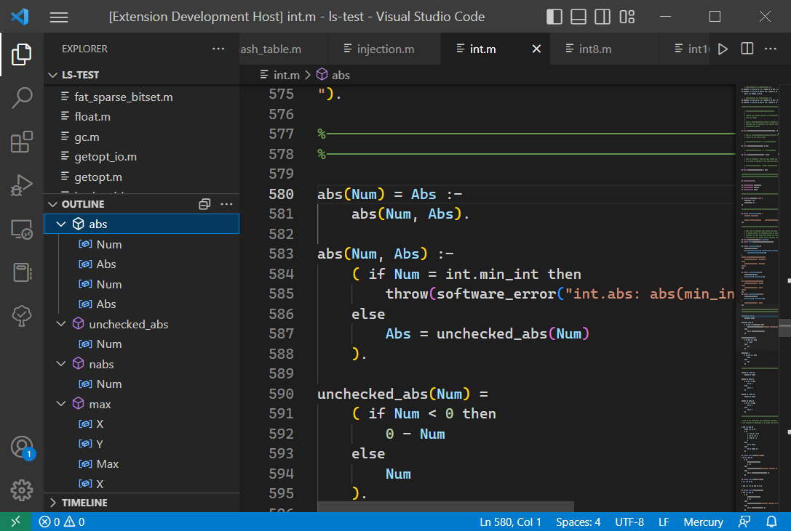
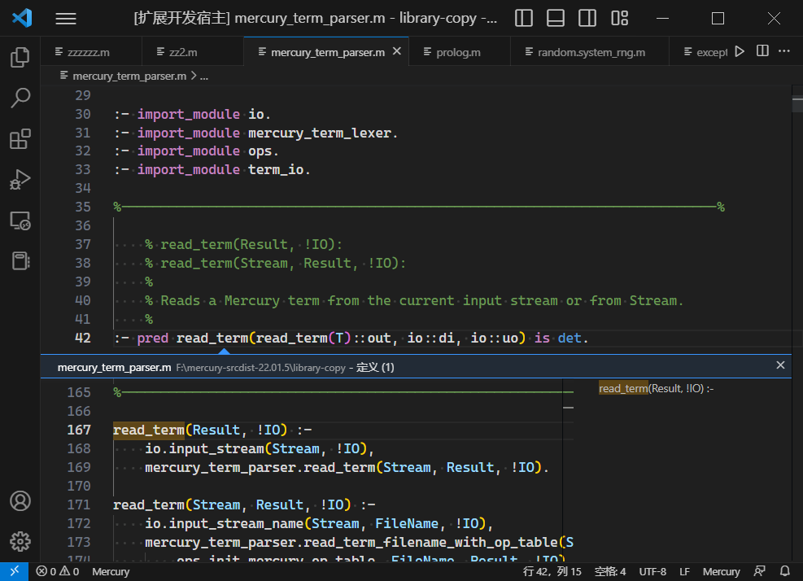
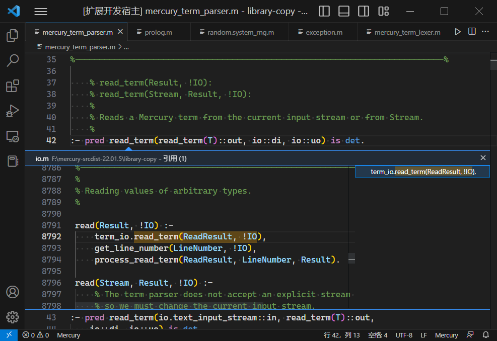
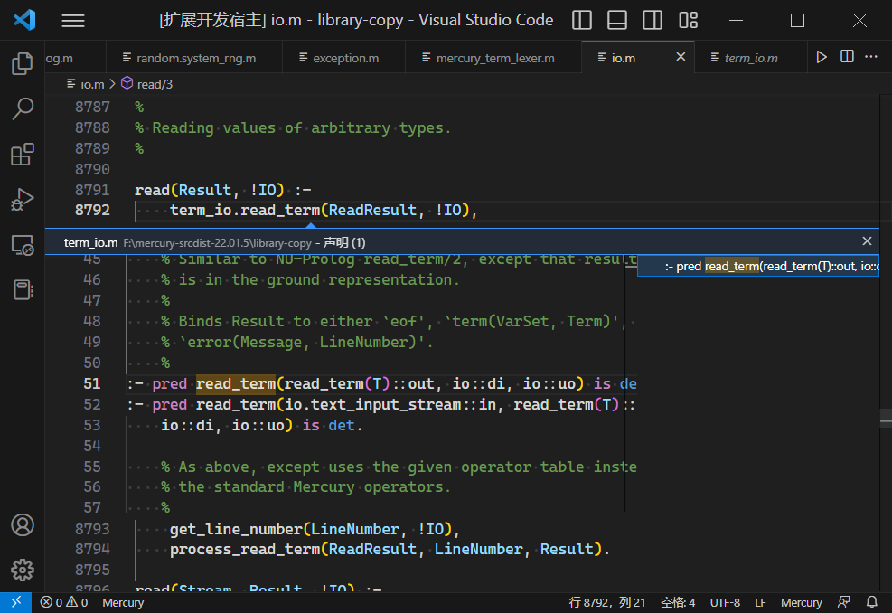

# Mercury ls
* Outline
* Goto definition
* Find reference
* Find declaration
* Show call hierarchy
  
## outline

## Goto definition

## Find reference

## Find declaration

## Show call hierarchy

